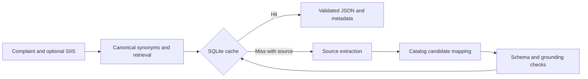

# Smart Guided Troubleshooting Engine

Samsung PRISM Gen AI Hackathon 3.0, **Theme 2**. Team **The Semicolons**, SRM Institute of Science and Technology, Chennai.

Repository: https://github.com/Lakshmi98496/samsung-prism

Turns a complaint and optional SIIS source text into JSON troubleshooting instructions with catalog mappings. A running offline baseline is included. A two-stage model adapter selects source line IDs and then catalog IDs, while Python enforces grounding and URI integrity. A **local Qwen2.5-0.5B CPU smoke test** is recorded in `docs/model_smoke.json`. It demonstrates two model calls and a repeated cache hit on one short synthetic source, not general accuracy.

## Run locally (Python 3.12)

```powershell
python -m venv .venv
.\.venv\Scripts\Activate.ps1
python -m pip install -r requirements.txt
python -m uvicorn app.main:app --host 127.0.0.1 --port 8000
```

On Linux/macOS use `source .venv/bin/activate`. Open **http://127.0.0.1:8000** for the demo, **/docs** for the API explorer.

```powershell
python -m pytest -q
python scripts/benchmark.py
```

## API

- `GET /health`: initialization, dataset sizes and runtime mode.
- `GET /v1/scenarios`: the 20 supplied demo queries.
- `POST /v1/troubleshoot`: request `{ "query": "your complaint", "siis_response": "optional source text" }`. `siis_response` also accepts `{ "title": "...", "content": "..." }`.
- Response: `{ "query": "...", "response": { "contexts": [...] }, "meta": { "cache_hit": true, "latency_ms": 1.2, "model": "offline-extractive", "fallback": null, ... } }`.

Without source text, conservative retrieval resolves a supplied reference query, then loads its prevalidated plan. Unknown issues return empty contexts with `no_match`. Changed source or query creates a different cache identity. Plans use exact source sentences and literal catalog URIs. No web URLs enter generated step text. Critical operations sort last. The original organiser schema is preserved in `data/schema.py`.

## Architecture



Default extraction uses deterministic imperative sentence rules. Default retrieval uses TF-IDF cosine similarity with a small synonym vocabulary; it is **not BM25 or a learned semantic embedding**. Dense query matching is optional. Mapping requires an exact catalog feature name and compatible enable/disable direction. Uncertain mappings remain manual with null deeplinks. The baseline does not yet enforce perfect one-screen grouping or retain every conditional sentence. Model action grouping preserves source section boundaries and removes duplicate line selections. The goal score is a fixed, uncalibrated baseline value, not measured confidence.

## Optional two-stage LLM mode

The tested Windows path uses a portable llama.cpp runtime and official Qwen model weights. No API key or account is required. These downloads stay in the ignored `.local-model` directory and are not uploaded to GitHub:

```powershell
powershell -ExecutionPolicy Bypass -File scripts/setup_local_model.ps1
powershell -ExecutionPolicy Bypass -File scripts/start_local_model.ps1
# In another terminal:
$env:LLM_BASE_URL="http://127.0.0.1:8081/v1"
$env:LLM_MODEL="qwen2.5-0.5b"
python -m uvicorn app.main:app --port 8000
```

The script changes execution policy for that process only. Download size is approximately 491 MB for weights plus the CPU runtime. Hardware must support the official Windows x64 binary. Official sources: [llama.cpp release b11388](https://github.com/ggml-org/llama.cpp/releases/tag/b11388) and [Qwen2.5-0.5B-Instruct-GGUF](https://huggingface.co/Qwen/Qwen2.5-0.5B-Instruct-GGUF). The model revision is pinned in the script. `python scripts/test_local_model.py` repeats the live smoke evaluation while the server is running.

Alternatively use Ollama or a compatible hosted JSON-schema chat endpoint. Ollama example (installation and download required separately):

```powershell
ollama pull qwen2.5:7b
# Ollama must be running.
$env:LLM_BASE_URL="http://localhost:11434/v1"
$env:LLM_MODEL="qwen2.5:7b"
python -m uvicorn app.main:app --port 8000
```

Send **new SIIS source text** to exercise a cache miss. Prewarmed supplied scenarios intentionally use the offline baseline and report their origin. Stage 1 returns normalized query, paraphrases, action headings and source line IDs. Stage 2 batches candidate catalog choices. Python copies actual steps/URIs, validates the result, and rejects invalid model output with `generation_failed`. The model cannot supply new executable steps or fabricated URIs.

Hosted endpoints can also use `LLM_API_KEY` as an environment variable. Never commit keys. Configure `LLM_INPUT_USD_PER_MILLION` and `LLM_OUTPUT_USD_PER_MILLION` for provider cost estimates (use zero for local inference). Missing rates report unknown cost for model calls. Zero inference calls report zero inference cost, excluding compute/storage costs. The adapter requires structured JSON-schema output support. Query variations combine unique model output with templates to supply 8–10 distinct strings. They are not a validated paraphrase test set.

Model inference defaults to a 60-second per-call timeout, configurable with `LLM_TIMEOUT_SECONDS`, and has no cold-latency guarantee. The tiny local model is slower than the guide's eight-second cold-path target and can omit relevant instructions. Larger models require their own evaluation. This project does not claim full compliance on accuracy, latency, conditional context or screen grouping.

## Optional dense query retrieval

```powershell
python -m pip install -r requirements-dense.txt
$env:USE_DENSE_EMBEDDINGS="1"
python -m uvicorn app.main:app --port 8000
```

This downloads `sentence-transformers/all-MiniLM-L6-v2` and switches query retrieval to embedding cosine similarity. Deeplink matching remains conservative lexical matching. Dense mode is not part of the reported baseline benchmark.

## Docker

```text
docker build -t semicolons-prism .
docker run --rm -p 8000:8000 semicolons-prism
```

Use `-e LLM_BASE_URL=http://host.docker.internal:11434/v1 -e LLM_MODEL=qwen2.5:7b` to reach a host model service on Docker Desktop. Docker is not installed in the development workspace, so container execution remains unverified.

## Results and limitations

See `docs/benchmark.json` for measured offline results and platform details. The benchmark checks all 20 supplied queries for schema conformity, source grounding, ordering and catalog integrity, then measures warm engine calls. These are checks on provided examples, not independent accuracy evaluation. It does not measure full HTTP latency, LLM latency, real-device success, screen accuracy or unseen paraphrase hit rate.

The organiser's catalog has **578 entries**, including masked URIs. They are evaluation tokens, not working phone links. Some supplied query/source pairs appear mismatched or contain unrelated sections. The offline baseline follows those supplied pairs and cannot establish diagnostic correctness. Do not execute the output automatically on a device. The live smoke report measures one short source, while the baseline benchmark covers all 20 provided queries. Neither establishes unseen accuracy.

## Team and submission

- Vaibhavi Sharma — bv5156@srmist.edu.in
- Kottadi Lakshmi — lk9601@srmist.edu.in
- Vivek Vaddipalli — vv8326@srmist.edu.in

Deck: `submission/SRMIST_TheSemicolons_Submission.pptx`. Demo link: `submission/DEMO_LINK.md` (pending). Recording script: `docs/DEMO_SCRIPT.md`. AI disclosure draft: `docs/AI_DISCLOSURE.md`. Review and remaining requirements: `docs/SUBMISSION_REVIEW.md`.

Once **all final artifacts and the demo link** are committed:

```text
git tag PRISM_GENAI_HACKATHON_Y2026
git push origin main
git push origin PRISM_GENAI_HACKATHON_Y2026
```

The tagged commit is what the organiser judges. Do not create the final tag while mandatory artifacts are pending.

## Data attribution

`data/siis_responses.json`, `data/deeplinks.json`, `data/schema.py`, and `data/sample_output.json` were supplied in the Samsung PRISM hackathon archive. They retain their original content. No independent redistribution license was provided in that archive. This repository uses them for the requested hackathon submission.
